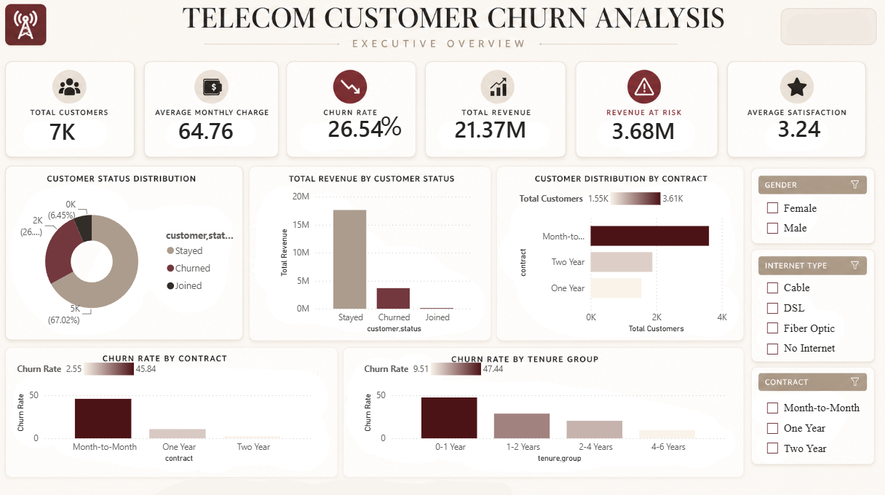
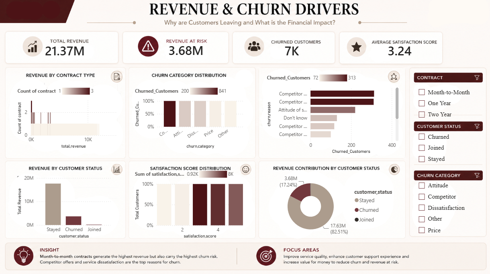
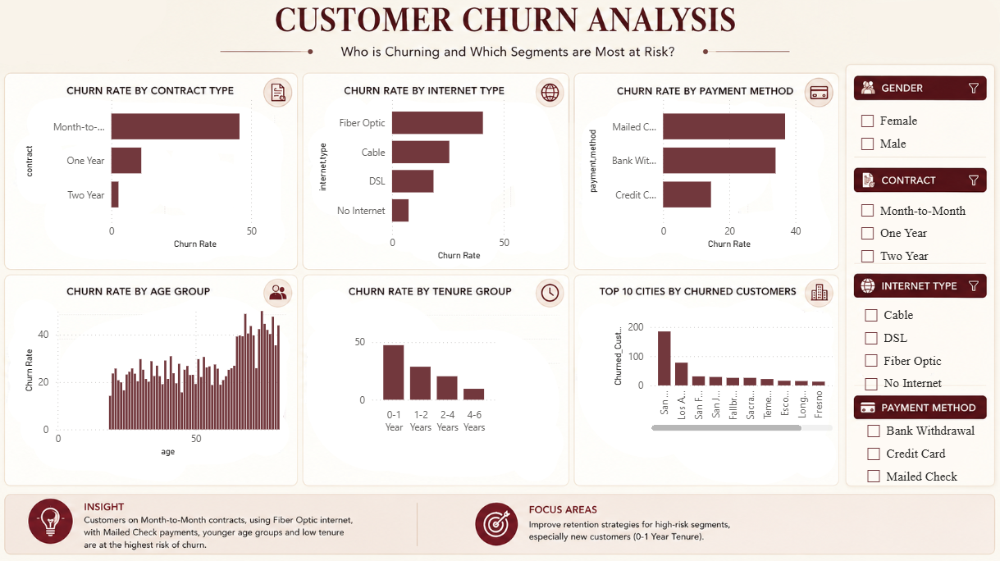

#  Telecom Customer Churn Analysis

An end-to-end data analytics project that analyzes customer churn using **Python**, **PostgreSQL**, and **Power BI**. The project identifies churn patterns, revenue impact, and customer behavior through data cleaning, SQL analysis, and interactive dashboards.

---

##  Tech Stack

* Python (Pandas, Matplotlib, Seaborn)
* PostgreSQL
* Power BI
* DAX

---

##  Workflow

```text
Raw Data
   ↓
Python (Cleaning & EDA)
   ↓
PostgreSQL (Business Analysis)
   ↓
Power BI Dashboard
   ↓
Business Insights
```

---

## Dashboard Preview


## Executive Overview



---

## Customer Churn Analysis



---

## Revenue & Churn Drivers



---

##  Key Insights

* Overall churn rate: **26.54%**
* Month-to-Month contracts have the highest churn.
* Fiber Optic customers are more likely to churn.
* Customers with shorter tenure show higher churn.
* Competitor-related reasons are the leading cause of customer loss.
* Revenue at risk exceeds **$3.6M**.

---

##  Repository Structure

```text
Telecom-Customer-Churn-Analysis
│
├── Dataset
├── Python
├── SQL
├── Power BI
├── Dashboard Images
└── README.md
```

---

##  Author

**Kunal Muneshwar**

Aspiring Data Analyst | Python | SQL | PostgreSQL | Power BI
